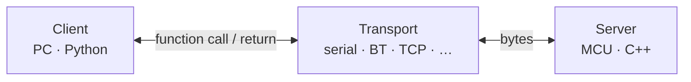

# LotusRPC 🌼

 [](https://sonarcloud.io/summary/new_code?id=tzijnge_LotusRpc) [](https://github.com/astral-sh/ruff) [](https://github.com/PyCQA/pylint)

[](https://sonarcloud.io/summary/new_code?id=tzijnge_LotusRpc)

RPC framework for embedded systems based on [ETL](https://github.com/ETLCPP/etl). Define your interface once in YAML; LotusRPC generates all C++ server code and a Python client. No dynamic memory allocations, no exceptions, no RTTI.



## Features

- **No dynamic memory** — stack-only, no heap, no exceptions, no RTTI
- **Transport agnostic** — any byte-oriented channel (serial, Bluetooth, TCP, …)
- **YAML definitions** — schema-validated, editor-friendly, easy to parse or extend
- **Code generation** — `lrpcg` produces all C++ server code in one command
- **CLI client** — `lrpcc` lets any team member call remote functions without writing code
- **Streams** — client-to-server and server-to-client data streams, finite or infinite
- **C++11 compatible** — works on any platform with a modern C++ compiler

## Quick start

**Install:**

```bash
pip install lotusrpc
```

**Define your interface** (`math.lrpc.yaml`):

> [!NOTE]
> By convention, LotusRPC definition files use the `.lrpc.yaml` extension.

```yaml
name: math
settings:
  namespace: ex
services:
  - name: calc
    functions:
      - name: add
        params:
          - { name: a, type: int32_t }
          - { name: b, type: int32_t }
        returns:
          - { name: result, type: int32_t }
```

**Generate C++ server code:**

```bash
lrpcg cpp -d math.lrpc.yaml -o generated/
```

**Implement the server** — derive from the generated shim and implement the pure virtual function:

```cpp
#include "math/math.hpp"

class CalcService : public ex::calc_shim
{
protected:
    int32_t add(int32_t a, int32_t b) override
    {
        return a + b;
    }
};
```

Subclass the generated server to provide a transport, register your service, and feed incoming bytes:

```cpp
class MathServer : public ex::math
{
    void lrpcTransmit(lrpc::span<const uint8_t> bytes) override
    {
        uart_write(bytes.data(), bytes.size());  // your hardware here
    }
};

CalcService calc;
MathServer server;
server.registerService(calc);

// In your receive loop:
server.lrpcReceive(incoming_byte);
```

**Call from the command line:**

```bash
lrpcc calc add 3 7   # result = 10
```

## Documentation

Full documentation is at **[tzijnge.github.io/LotusRpc](https://tzijnge.github.io/LotusRpc/)**, including:

- [Getting started](https://tzijnge.github.io/LotusRpc/getting_started) — complete walkthrough
- [Interface definition reference](https://tzijnge.github.io/LotusRpc/reference/definition) — all YAML options
- [C++ API reference](https://tzijnge.github.io/LotusRpc/cpp_api) — generated server and shim classes
- [Python API](https://tzijnge.github.io/LotusRpc/python-api/client) — client library and definition model
- [Examples](https://tzijnge.github.io/LotusRpc/examples) — math service and STM32 example
